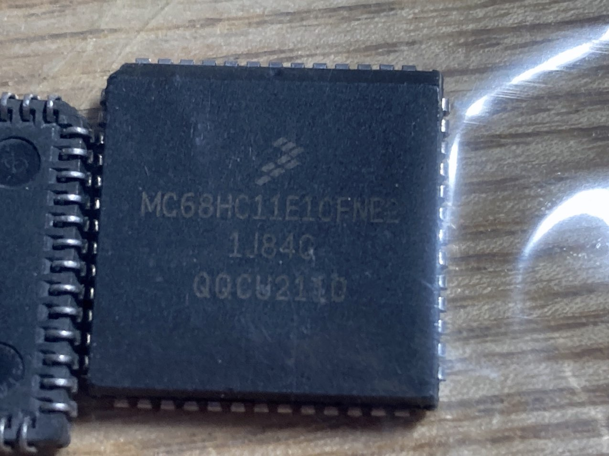

# MEZ68HC11E

A memorandum for MEZ68HC11E board design and firmware implementation

## Introduction

どなたかのツイートにあてられて、eBayで`MC68HC11`を注文しました。届いたものを開封すると、`MC68HC11E1`、PLCC52ピンでした。

マニュアルを手に入れて読んでみると、インデクスレジスタが2本ある。アキュムレータも2個ある。これならForth載せるのも面白そうだということで、動かしてみようかという気になった。

<figure style="text-align: center">

</figure>

秋月でソケットを買って手配線でいいかと思っていたら、秋月には52ピンソケットの持ち合わせはないようで、仕方がないので基板を起こしてJCLPCBに発注しました。

次に買うときはPDIPにしよう。48pinのMC68HC11Aシリーズ化、40pinのMC68HC11Dシリーズ。

## Concept

ということで、奥江さん流にメザニン基板を起こしたのです。ファームはいつもの自己流。

* SRAM搭載のEMUPU_RAM40/48を使う。よってCPUのみのメザニン基板。
* PICファーム書き込み用に、CPUのA6/A7 をHi-Zにする必要がある。まずSingle Chipモードで起動し、ファーム実行開始後はExpanded Modeに切り替える。
* テキストアップロードでSRAMにプログラムを書き込む。アドレスバス上位をHi-Zにできないので、命令置きで書き込むしかない。
* I/O(シリアル)はPICのポートを使う。よってI/OポートはPIC側で実現する。68系だから、Eクロックの引き延ばしと、Eクロック下りエッジ直後、アドレス送出までの間を延ばす。

さてさて、無事に起動したら拍手御喝采！

